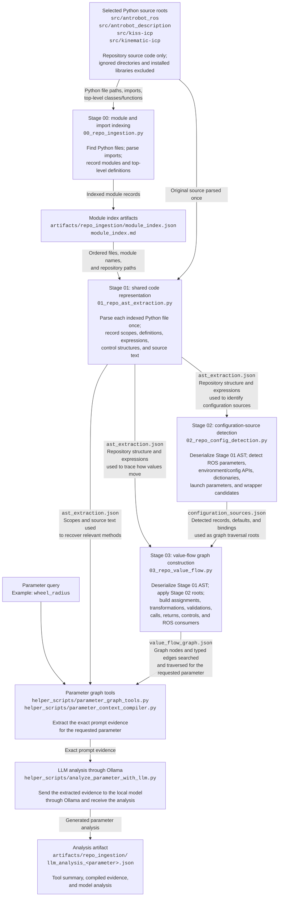

# Repository-analysis pipeline — 8 August 2026

## Purpose

This diagram documents the pipeline as it is implemented now. It separates:

1. repository-wide artifact generation;
2. parameter-specific graph retrieval;
3. context compilation;
4. optional Ollama analysis.

The labels on arrows describe the information transferred between stages,
even when the receiving script reads that information from an artifact on disk
rather than receiving it as a direct function argument.

## Complete implemented pipeline

## Important implementation details exposed by the diagram

### Stages 00–03 are now sequential data dependencies

`01_repo_ast_extraction.py` is the only analysis stage that parses the selected
Python source. It stores a lossless JSON representation of the complete Python
AST together with the exact source snapshot and the readable scope inventory.
Stage 02 deserializes that AST to detect configuration sources. Stage 03
deserializes the same AST and combines it with Stage 02's catalog to build the
value-flow graph. Neither Stage 02 nor Stage 03 calls `ast.parse` or rereads the
repository source.

### The parameter tool reuses the Stage 01 representation

The value-flow graph contains locations and scopes, not complete source files.
After graph traversal, `parameter_graph_tools.py` uses Stage 01's serialized AST
and embedded source snapshot to recover complete enclosing functions and
methods. It does not create another parser path or reread source for extraction.
