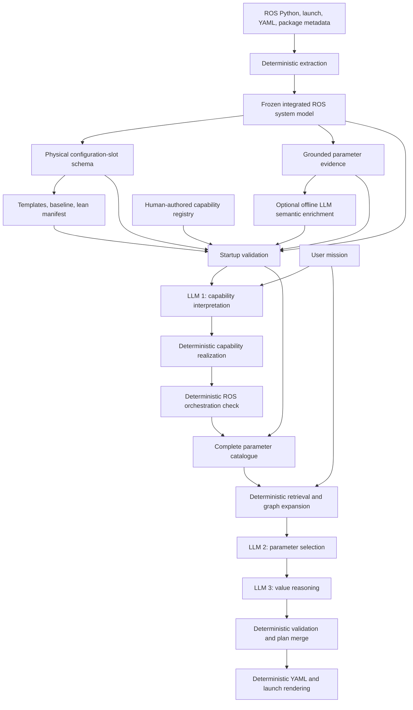

# Mission-to-ROS architecture

This document explains the complete research prototype: which information is prepared ahead of time, what happens at application startup, what happens for each mission, and where the LLM is allowed to make decisions.

For the derivation of the frozen artifacts, see [Code interpretation and deterministic artifact architecture](code_interpretation_architecture.md). For experiment design, see [AI evaluation and ablations](ai_evaluation.md).

## Research focus

The prototype is organized around this question:

> Does structured source-code, ROS-system, and parameter-relationship evidence improve an LLM's ability to select the correct ROS configuration parameters and derive valid values?

Static extraction is therefore a grounding mechanism. It supplies facts the model should not guess. Validation and rendering demonstrate that a model proposal can be checked and applied. The principal AI work is:

- semantic interpretation of parameters from evidence;
- retrieval of relevant configuration records;
- selection of the parameters implied by a user request;
- reasoning about their new values and dependencies;
- evaluation of those boundaries under controlled context ablations.

## Three time scales

Many earlier explanations mixed together artifact generation, startup, and mission processing. They are separate.

### 1. Artifact-generation time

The repository is analyzed deterministically. The process produces:

- an integrated ROS system model;
- a physical configuration-slot schema;
- source-grounded parameter evidence;
- Jinja templates, a baseline profile, and a lean renderer manifest.

The capability registry is different: it is human-authored robot design knowledge. It declares supported capability implementations and their concrete deployment recipes, then is checked against the generated system and configuration artifacts.

Optional LLM semantic enrichment can also be produced offline. It never overwrites deterministic facts.

The canonical regeneration entry point is:

```bash
PYTHONPATH=src python helper_scripts/regenerate_artifacts.py --workspace .
```

It rebuilds the deterministic chain in dependency order: integrated system model, physical configuration-slot schema, templates/baseline/lean manifest, parameter evidence, and generated scenario bundles. It also records artifact hashes in `artifacts/ARTIFACTS.json`. Because the command replaces the semantic-artifact directory, it removes any previous optional enrichment; enrichment must be regenerated afterward if an experiment requires it.

### 2. Application startup

The application first reads the single flat configuration object in
`src/ros_config_builder/parameters.yaml`. Its `operation` field selects `mission`, `analyze`, or
`validate`; the remaining fields provide all paths, LLM settings, retrieval settings, and
operation inputs. `ApplicationConfiguration` rejects unknown or invalid values before dispatch.
No application command-line parser is involved.

For a mission operation, the application then loads the saved artifacts once. “Frozen” means
that a saved snapshot is treated as the stable input to the run; it does not mean ROS has a
frozen-system feature.

Startup checks include:

- required files exist and have supported schema versions;
- the capability registry names known components, renderer keys, and wiring bindings;
- the parameter-evidence hashes match the loaded system model and configuration schema;
- when optional semantic enrichment is requested, its system-model and configuration-schema hashes also match before its hypotheses are used.

The resulting in-memory objects are reused for all missions handled by that application instance.

### 3. Per-mission processing

A per-mission realization is a temporary, validated answer to:

> For this particular request, which supported capabilities, components, connections, and configuration values should be active?

It is not another generated repository artifact, and it does not start or execute ROS nodes. It is the plan from which files are rendered.

## Full data flow



The runtime uses three distinct LLM calls:

1. capability interpretation — what high-level robot functions are requested;
2. parameter selection — which retrieved configuration slots express the request;
3. value reasoning — what the selected slots should become.

Optional offline semantic enrichment is a fourth LLM task, but it is not required for each mission.

## Deterministic facts versus model hypotheses

The boundary is intentional.

| Deterministic facts | LLM interpretation |
|---|---|
| Parameter identifier, type, default, and effective value | What the parameter means |
| Declaration and read locations | Physical quantity and unit |
| Launch/YAML target | Behavioral effect |
| Node, publisher, subscriber, topic, and message type | Which user phrase refers to which parameter |
| Extracted relationships and wiring groups | Which related parameters are relevant |
| Supported capability recipes | New values derived from natural language |
| Type/range/allowed-value checks | Concise externally verifiable justification |

Semantic enrichment is explicitly labelled as a hypothesis, contains evidence IDs, confidence, model identity, and prompt version, and remains replaceable.

## Running example

Consider:

> Map using KISS-ICP and limit its range to 20 metres.

### Capability interpretation

The first LLM returns a sparse structured interpretation:

```text
mapping: enabled, default implementation
odometry: enabled, KISS-ICP explicitly selected
```

The phrase about 20 metres is retained for later parameter reasoning.

### Capability realization

The validated registry expands those choices into claims:

```text
enable Cartographer
enable KISS-ICP
enable LaserScan-to-PointCloud conversion
disable the displaced kinematic ICP implementation
```

These claims become concrete launch overrides. “Disable” here means setting the relevant launch inputs to `false`; it does not mean running a disabled implementation.

### ROS orchestration

The system model and wiring facts are used to check the required chain:

```text
rplidar_node --LaserScan--> laserscan_to_pointcloud --PointCloud2--> kiss_icp
```

Topic names, message types, endpoint roles, and known QoS policies are compared. A confirmed missing or incompatible required connection stops the mission. An external dependency that cannot be fully inspected is recorded as `partially_verified` rather than falsely claimed as confirmed.

### Parameter retrieval and reasoning

The complete catalogue contains every one of the 109 physical configuration slots, including inactive components. A deterministic lexical retriever ranks records for the mission, then the graph variant can add related records within a bounded number of hops.

The parameter-selection LLM receives only the bounded context and may select only IDs present in it. It should identify:

```text
nodes.kiss_icp.max_range
```

The value-reasoning LLM receives the selection, current value, evidence, and relevant relationships. It proposes the old and new value. It cannot introduce a parameter that was not selected.

### Validation and rendering

Deterministic code checks the identifier, old value, type, allowed values, numeric bounds, and conflicts with capability launch choices. It merges the result with capability overrides, overlays the sparse plan on the generated baseline, and renders ROS parameter YAML and a wrapper launch file.

The LLM never writes YAML, Python launch source, Jinja expressions, or filesystem paths.

## Why there are 109 slots but 114 occurrences

The configuration schema models writable physical locations rather than pretending every effective node value is independently writable.

For example, a YAML selector such as `/**` can assign one value to more than one deployed component. Earlier versions represented those occurrences as separate keys even though both keys targeted the same YAML location. That allowed one value to be silently ignored.

Schema version 3.0 collapses each shared target into one slot and records all affected components:

```json
{
  "parameter_id": "nodes.explore.some_parameter",
  "affected_components": [
    "explore",
    "explore_lite_map_converter"
  ]
}
```

The current counts are:

- 16 launch-argument slots;
- 93 physical ROS-parameter slots;
- 109 total writable slots;
- 114 effective ROS-parameter occurrences.

## No configuration permission policy

There is no `configurable`, `fixed`, `derived`, `approved`, or `rejected` gate. Hardware geometry, algorithm settings, topic names, frame names, and launch arguments are all visible if they correspond to a discovered writable slot.

Semantic categories may still be inferred because they help the LLM understand a parameter. They are descriptive metadata, not authorization. A user can therefore request a wheel-radius change or a topic-name change; correctness is enforced through grounding and deterministic validation rather than a manually maintained permission list.

## The artifacts and their roles

| Artifact | Origin | Role |
|---|---|---|
| `artifacts/ros_system_model/ros_system_model.json` | Deterministic extraction and integration | Components, deployment instances, effective parameters, ROS interfaces, provenance, and graph facts |
| `artifacts/template_configuration/template_configuration_schema.json` | Deterministic projection of the system model | The complete physical configuration-slot interface |
| `artifacts/semantic_parameters/evidence.json` | Deterministic evidence packaging | Bounded declarations, reads/usages, interfaces, relationships, and input hashes |
| `artifacts/semantic_parameters/enrichment.json` | Optional LLM enrichment | Separately versioned semantic hypotheses; not required by default |
| `configuration_templates/manifest.json` | Deterministic template generation | Template routes, output strategies, baseline path, and wiring groups |
| `configuration_templates/profiles/baseline.yaml` | Deterministic template generation | A complete value for every schema slot |
| `configuration_templates/capability_registry.yaml` | Human-authored and cross-validated | Supported capability design knowledge and deployment recipes |

The renderer manifest is operational, not just a debugging report. Rendering reads its `templates` and `baseline_profile`; orchestration and graph expansion read its `wiring_bindings`. It intentionally does not duplicate the full schema or per-key target records.

## Step boundaries

### Step 2 — capability interpretation

The capability LLM sees a safe semantic projection of the validated registry. It returns `valid`, `unsupported`, or `needs_clarification` with a strict sparse contract. See [Step 2](step_2_capability_interpretation.md).

### Step 3 — capability realization

Deterministic code resolves defaults, dependencies, conflicts, components, and renderer claims for one mission. See [Step 3](step_3_capability_realization.md).

### Step 4 — ROS orchestration

The active realization is projected onto the frozen system model and required connections are checked. See [Step 4](step_4_ros_orchestration.md).

### Step 5 — catalogue and evidence

The complete physical-slot schema is combined with source evidence, optional enrichment, and active-system context. See [Step 5](step_5_parameter_catalogue.md).

### Step 6 — retrieval and two-stage parameter reasoning

Bounded context is retrieved. One LLM selects parameters and another derives values. See [Step 6](step_6_parameter_reasoning.md).

### Step 7 — validation and plan construction

Deterministic code validates the proposals and merges them with capability overrides. See [Step 7](step_7_parameter_validation_and_plan.md).

### Step 8 — rendering

The plan is merged with the baseline and rendered through generated Jinja templates. Runtime performs syntax/structure validation; expensive re-extraction equivalence is an explicit offline option. See [Step 8](step_8_rendering.md).

## Terminal outcomes and safety boundaries

The AI stages can return:

- `valid` — continue;
- `no_change` — parameter reasoning found no requested configuration change;
- `unsupported` — the request cannot be represented by the known system;
- `needs_clarification` — material information is missing.

In addition, deterministic failures stop processing when:

- a registry reference is stale or invalid;
- required local ROS wiring is missing;
- known QoS policies are incompatible;
- an LLM invents a parameter or evidence ID;
- value reasoning introduces an unselected parameter;
- the supplied old value is stale;
- a new value violates a type, allowed-value, or discovered range constraint;
- a parameter change conflicts with a capability realization;
- generated launch or YAML syntax is invalid.

The application generates files only. Starting the generated ROS launch system remains a separate operator action.

## Research variants

The parameter pipeline supports five controlled context variants:

1. `names_values` — identifiers, names, types, and current values;
2. `semantic` — adds descriptions, units, categories, effects, and constraints;
3. `source` — adds declarations and usage excerpts;
4. `system` — adds related ROS interfaces;
5. `graph` — adds relationships and bounded graph expansion.

This makes the deterministic infrastructure scientifically testable: the evaluation can measure whether each form of grounding improves retrieval, selection, value generation, abstention, and end-to-end correctness.
