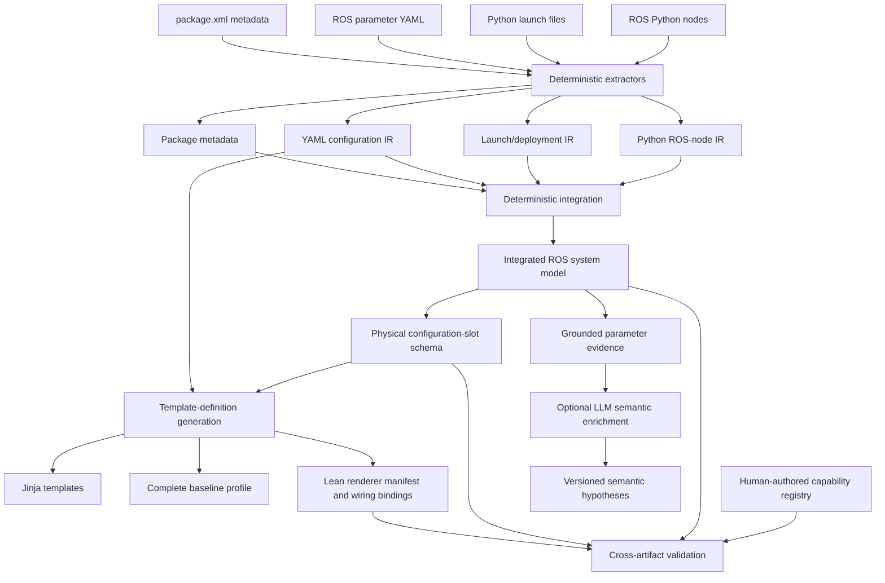

# Code interpretation and deterministic artifact architecture

This document explains where the stable ROS facts used by the mission pipeline come from. It distinguishes generated artifacts from human-authored robot design knowledge and from optional LLM-generated semantic hypotheses.

The short answer is:

- the integrated ROS system model is deterministically generated from the repository;
- the configuration-slot schema, source-evidence artifact, templates, baseline, renderer manifest, and wiring bindings are deterministic projections of that model and its extracted configuration sources;
- the capability registry is human-authored robot design knowledge, then deterministically validated against the generated artifacts;
- semantic enrichment is optional LLM output stored separately from the facts.

## Why this layer exists

An LLM should not have to guess where a parameter is declared, which node consumes it, what value is currently effective, which file controls it, or which ROS interfaces surround it. Static analysis is used to assemble those facts into inspectable evidence.

The dissertation does not require perfect interpretation of arbitrary Python. The extractor is intentionally bounded. Its purpose is to provide trustworthy, reproducible grounding for semantic and configuration reasoning.

## Artifact lineage



## Stage A — deterministic source extraction

### Python ROS-node extraction

`src/ros_config_builder/extraction/python.py` parses Python source into an intermediate representation. Relevant facts include:

- node classes and constructors;
- `declare_parameter` calls and declared defaults;
- parameter reads and assigned variable names;
- publishers, subscriptions, services, clients, timers, and TF-related interfaces;
- source locations;
- locally recoverable value and usage relationships.

Each fact retains provenance. An unresolved expression remains explicitly unresolved rather than being filled with a model guess.

### Launch extraction

`src/ros_config_builder/extraction/deployment.py` interprets the supported launch constructs, including:

- declared launch arguments and defaults;
- included launch files and forwarded arguments;
- node package, executable, name, namespace, parameters, remappings, and conditions;
- configuration-file references;
- source locations for launch declarations.

Launch extraction answers how source-level nodes become deployment instances under a selected root launch file.

### YAML extraction

The deployment extractor also parses ROS parameter YAML. It records:

- source file;
- node selector, including wildcard selectors such as `/**`;
- nested parameter path;
- parsed value;
- the deployment instances to which the assignment applies during integration.

This distinction is important: one YAML assignment may yield several effective parameter occurrences but remains one physical writable location.

### Package metadata

`src/ros_config_builder/integration/system_model.py` reads package metadata such as package names and locations. This helps connect launch references and executables to local source packages, and explicitly identifies external components that cannot be inspected locally.

## Stage B — integrated ROS system model

`build_system_model()` combines the extracted facts under one or more selected root launch files. The saved canonical model is:

```text
artifacts/ros_system_model/ros_system_model.json
```

The integrated model contains, among other data:

- deployment instances and their resolution status;
- effective node names and namespaces;
- enabled conditions;
- effective parameters with layered provenance;
- source inventories;
- effective publishers and subscriptions;
- topics, message types, services, remappings, and known QoS descriptions;
- launch-argument flow;
- graph edges and validation results.

### How effective values are obtained

Configuration values can originate from several layers. Integration preserves those layers and resolves the effective value according to the modeled deployment order. A typical provenance chain can contain:

```text
Python declaration default
        -> YAML assignment
        -> launch-file parameter source
        -> root launch override
        -> effective deployment value
```

The exact chain differs by value. Provenance is retained so downstream evidence can point back to the controlling source rather than merely showing the final number.

### What “frozen integrated ROS system model” means

“Frozen” means the JSON snapshot is generated, validated, saved, and then treated as an immutable experimental input until deliberately regenerated. It does not mean a ROS graph is paused, and it is not a runtime object obtained from a live robot.

Freezing gives the application and experiments:

- repeatable inputs;
- stable identifiers and provenance;
- a clear repository-to-artifact boundary;
- protection from silently changing context between model runs.

When ROS source, launch structure, YAML, or package metadata changes materially, the model must be regenerated.

## Stage C — physical configuration-slot schema

`build_template_configuration_schema()` projects the integrated system model into the values the prototype can write through ROS parameter YAML or root launch arguments. The saved artifact is:

```text
artifacts/template_configuration/template_configuration_schema.json
```

Schema version 3.0 contains:

- a stable `configuration_keys` inventory;
- launch-argument records;
- ROS-parameter records grouped by canonical component;
- type, default, current value, provenance, and targets;
- affected components;
- extracted parameter relationships;
- interface-parameter IDs;
- summary counts.

`configuration_keys` belongs to this schema. It is not duplicated in the renderer manifest.

### Why the schema models physical slots

The system model describes effective parameter occurrences. The renderer must describe writable locations. Those are not always one-to-one.

Suppose this YAML exists:

```yaml
/**:
  ros__parameters:
    some_parameter: 10
```

If both `explore` and `explore_lite_map_converter` receive that assignment, integration sees two effective occurrences. Rendering, however, has only one value it can write: the single `/**/ros__parameters/some_parameter` location.

The schema therefore creates one slot and records:

```json
{
  "template_key": "nodes.explore.some_parameter",
  "affected_components": [
    "explore",
    "explore_lite_map_converter"
  ]
}
```

This prevents contradictory aliases and silent last-write/first-write behavior.

### Current generated surface

The current schema has:

- 16 launch arguments;
- 93 physical ROS parameter slots;
- 109 total configuration slots;
- 114 effective ROS parameter occurrences;
- 22 interface-related parameter slots.

Every physical slot is included. No human-maintained configuration policy filters the list.

## Stage D — grounded parameter evidence

`build_parameter_evidence()` joins schema slots back to their source and system facts. The frozen artifact is:

```text
artifacts/semantic_parameters/evidence.json
```

For each parameter it can contain:

- parameter ID, name, kind, type, default, and current value;
- canonical and affected components;
- bounded declaration excerpts;
- parameter-read and lexical-usage excerpts;
- related ROS interfaces;
- source provenance;
- extracted source relationships;
- related parameter IDs.

Each excerpt or interface fact has a stable evidence ID. LLM outputs may cite only IDs actually supplied in their context.

### Evidence is bounded

The evidence builder does not copy entire repositories into prompts. It uses source references already discovered by extraction and small contextual windows around declarations, reads, and relevant usages. Retrieval later chooses only a bounded subset of parameter records.

### Evidence freshness

The evidence artifact contains:

```text
schema_version
source_model_sha256
configuration_model_sha256
parameters
```

At startup, the two hashes are recomputed from the loaded system model and configuration schema. A mismatch causes startup to fail with a stale-artifact error. Evidence is never silently combined with a different source snapshot.

## Stage E — templates, baseline, and renderer manifest

`build_template_definition()` uses the physical-slot schema and integrated configuration facts to generate:

- `configuration_templates/launch/antrobot_profile.launch.py.j2`;
- ROS parameter YAML templates under `configuration_templates/config/`;
- `configuration_templates/profiles/baseline.yaml`;
- `configuration_templates/manifest.json`.

### Baseline profile

The baseline has exactly one value for every schema key. Rendering overlays scenario values and per-mission values on this complete map.

Definition validation requires exact set equality between:

- schema `configuration_keys`;
- baseline keys;
- parameter keys referenced by the generated Jinja templates.

A missing, duplicate, or unknown key is a generation error.

### Lean manifest

The manifest is deliberately small. Its top-level fields are:

```json
{
  "schema_version": "3.0",
  "templates": [],
  "wiring_bindings": {},
  "baseline_profile": "profiles/baseline.yaml"
}
```

The fields mean:

| Field | Operational use |
|---|---|
| `schema_version` | Reject incompatible renderer definitions |
| `templates` | Identify Jinja inputs, output routes, overlay installation targets, and deployment strategy |
| `baseline_profile` | Locate the complete baseline value map |
| `wiring_bindings` | Group topic/frame slots that participate in one logical connection |

The manifest is used by the system. It is not merely a debugging file.

It no longer duplicates per-key handling rules or the schema inventory. The generated Jinja templates contain the concrete value references, and the schema contains the authoritative key/type/target facts.

### Wiring bindings

A wiring binding records a logical ROS name and the parameter slots that currently carry it. For example:

```json
{
  "wiring.scan_topic": {
    "baseline_value": "scan",
    "parameter_keys": [
      "nodes.kinematic_icp.lidar_topic",
      "nodes.laserscan_to_pointcloud.scan_topic"
    ]
  }
}
```

The bindings serve two current consumers:

- Step 4 resolves and checks required ROS connections;
- graph-aware retrieval connects related topic/frame parameters.

They are factual relationship metadata, not a rule that forbids the user from changing a topic or frame.

## Stage F — capability registry

The capability registry is:

```text
configuration_templates/capability_registry.yaml
```

Despite its location next to generated renderer files, it is human-authored robot design knowledge. Static analysis can discover nodes and connections, but it cannot reliably infer product-level decisions such as:

- that “mapping” is a supported user-facing capability;
- that Cartographer is its supported implementation;
- that exploration requires mapping;
- that KISS-ICP requires the LaserScan-to-PointCloud component;
- which alternative implementation must be displaced;
- which connections are required rather than merely present.

The registry records those design decisions declaratively.

### Registry terminology

Each capability contains:

- `component_family`: the complete set of components belonging to that capability's alternative implementations;
- `implementations`: supported implementations, their components, required connections, and enable-time `realization` overrides;
- `disable_overrides`: concrete renderer values that turn the capability off;
- capability dependencies and conflicts where applicable.

Applying `disable_overrides` performs the configuration actions required to disable the capability, normally by setting launch booleans to `false`. The component family is then marked inactive in the per-mission plan.

### Registry compilation and validation

Pydantic first checks the registry's internal schema. Startup validation then cross-checks it against generated artifacts:

- default implementations exist;
- component and connection IDs are unique where required;
- implementation components belong to the declared component family;
- capability dependency cycles are rejected;
- referenced components exist in the system/component catalogue;
- realization and disable-override keys exist in the configuration schema;
- required-connection endpoints are known components;
- required wiring-binding IDs exist in the manifest.

Thus the registry is authored by a programmer who knows the robot, but stale or malformed references are rejected deterministically.

## Stage G — optional LLM semantic enrichment

`helper_scripts/enrich_parameters.py` sends bounded deterministic evidence to an LLM using:

```text
prompts/parameter_semantic_enrichment.txt
```

For every requested parameter, the model may propose:

- a description;
- physical quantity and unit;
- semantic category;
- behavioral effects;
- constraints;
- related parameters;
- confidence;
- grounding evidence IDs.

The enrichment contract rejects unknown parameter IDs, unknown relationship targets, missing requested parameters, and invented evidence IDs.

The output artifact records:

- schema version;
- source-model hash;
- configuration-model hash;
- model identifier;
- prompt version;
- semantic hypotheses.

The application only loads it when explicitly requested. At startup, it recomputes the system-model and configuration-schema hashes and rejects an enrichment artifact if either hash differs. Without enrichment, deterministic names, values, evidence, interfaces, and relationships still support retrieval and reasoning.

## Build order and invalidation

The canonical regeneration command is:

```bash
PYTHONPATH=src python helper_scripts/regenerate_artifacts.py --workspace .
```

It performs the deterministic regeneration order as one workflow:

1. extract Python, launch, YAML, and package facts;
2. integrate and validate the ROS system model;
3. derive the physical configuration-slot schema;
4. generate templates, baseline, and lean manifest;
5. build the hash-bound evidence artifact;
6. validate the human-authored capability registry against the new artifacts;
7. rebuild the baseline and named scenario bundles, including offline equivalence checks by default;
8. write `artifacts/ARTIFACTS.json` with generation settings, counts, and output hashes.

The workflow replaces the generated system-model, configuration-schema, semantic-evidence, and scenario-output directories rather than mixing old and new files. Replacing `artifacts/semantic_parameters/` deliberately removes optional `enrichment.json`; run `helper_scripts/enrich_parameters.py` afterward if enrichment is required. Restoring an older enrichment is unsafe and ineffective because startup rejects hashes that do not match the regenerated system model and schema.

The `--skip-scenario-equivalence` option skips only the expensive offline scenario re-analysis. Normal mission rendering already skips equivalence independently. Unit and integration tests remain a separate validation command after regeneration.

Regenerate downstream artifacts when an upstream input changes:

| Change | Artifacts to reconsider |
|---|---|
| ROS node source or parameter declarations | System model, schema, templates, evidence; regenerate enrichment afterward if required |
| Launch files or root arguments | System model, schema, templates, evidence, registry validation |
| Parameter YAML | System model, physical slots, baseline, templates, evidence |
| Topic/frame parameters or interfaces | System model, wiring bindings, evidence, orchestration tests |
| Capability design | Capability registry and mission datasets; generated source artifacts need not change |
| Enrichment prompt or model | Enrichment artifact and AI evaluation; deterministic artifacts need not change |

## How runtime consumes the artifacts

At startup, `MissionApplication` loads the system model, configuration schema, manifest, evidence, and optional enrichment, then validates the capability registry. Evidence and enrichment hashes are checked against the loaded system model and schema before either is used.

For each mission:

1. Step 2 interprets capabilities using the registry's semantic projection.
2. Step 3 resolves the registry recipes into a per-mission realization.
3. Step 4 checks that realization against system interfaces and wiring bindings.
4. Step 5 creates the complete evidence-backed parameter catalogue.
5. Step 6 retrieves bounded context and performs separated LLM selection/value reasoning.
6. Step 7 validates and merges the proposed changes.
7. Step 8 renders the plan with the frozen templates and baseline.

The repository is not re-extracted during normal mission rendering. Expensive generated-bundle re-analysis remains available as an explicit offline equivalence test.

## Known boundaries

The static analysis is intentionally not a full Python symbolic executor. Some external or dynamic behavior remains unresolved. The model records that uncertainty instead of inventing a result.

The current retriever is a deterministic lexical baseline with exact-name weighting and bounded graph expansion. It establishes a reproducible experimental baseline; embedding or hybrid retrieval can implement the same result contract later.

The capability registry remains AntRobot-specific and human-authored. That is appropriate for the research boundary: the LLM studies configuration semantics and user intent, while explicit product design knowledge defines which complete robot stacks are supported.
