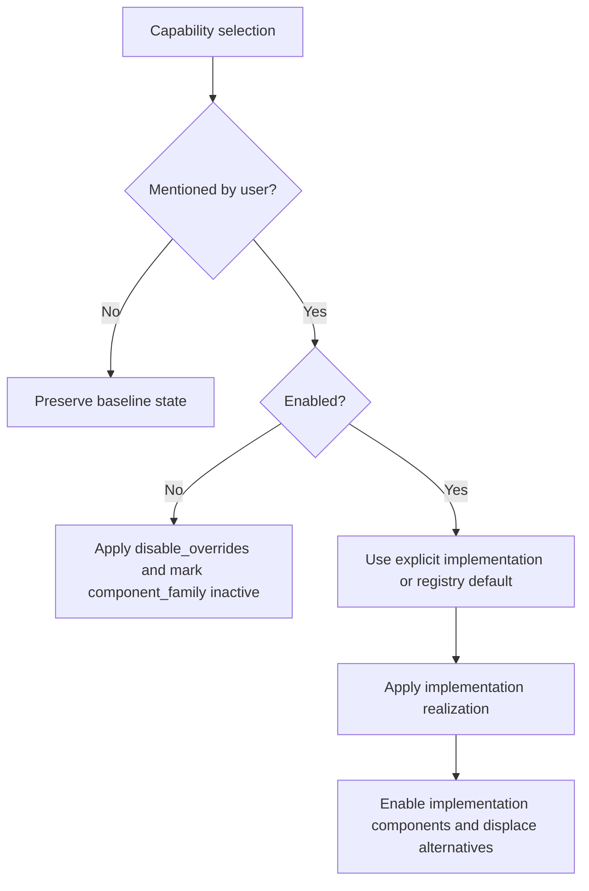

# Step 3 — deterministic capability realization

Step 3 converts the sparse capability choices from Step 2 into one concrete, traceable system plan for the current mission.

It is deterministic. No LLM call occurs here.

## What “per-mission realization” means

A per-mission realization is the resolved answer to:

> Given this mission and the supported AntRobot design, which capabilities and components are active, and which launch-level configuration values must change?

It is:

- created separately for each user request;
- held as a `SystemRealization` in memory and recorded in `mission_result.json`;
- consumed by orchestration, parameter reasoning, and rendering;
- a plan only — it does not launch ROS or execute a robot.

It is not the frozen ROS system model. The frozen model describes what the analyzed repository can deploy. The realization describes one requested selection from that known system.

## Inputs

Step 3 consumes two direct inputs:

1. validated `CapabilitySelections` from Step 2;
2. an `AntRobotCapabilityRegistry` that was loaded and cross-validated at application startup.

The startup validation of the registry also uses:

- the frozen integrated ROS system model, to verify component and connection references;
- the physical configuration-slot schema, to verify launch/configuration keys;
- the renderer manifest, to verify required wiring-binding IDs.

Those three artifacts are not repeatedly interpreted during every branch of Step 3. They establish that the registry is safe to use before mission processing begins.

## Where the registry comes from

`configuration_templates/capability_registry.yaml` is human-authored robot design knowledge. It is not generated automatically by the LLM and not fully inferable from static extraction.

The programmer declares supported product-level concepts such as capability names, implementation alternatives, required dependencies, and which known ROS connection is essential. Deterministic validation ensures those declarations reference real extracted components, configuration keys, and wiring facts.

## Registry terminology

### `component_family`

`component_family` is the complete set of components controlled by a capability across all its implementation choices.

For odometry:

```json
"component_family": [
  "kinematic_icp",
  "kiss_icp",
  "laserscan_to_pointcloud"
]
```

It is structural. It lets Step 3 determine which alternatives are displaced when one implementation is selected and which components become inactive when the capability is explicitly disabled.

### `realization`

Each implementation has a `realization` mapping. These are concrete configuration values needed to enable that implementation.

For KISS-ICP, conceptually:

```json
{
  "launch.launch_kinematic_icp": false,
  "launch.launch_kiss_icp": true,
  "launch.launch_laserscan_to_pointcloud": true
}
```

This is an enable-time recipe for a selected implementation.

### `disable_overrides`

`disable_overrides` is the set of concrete configuration values required to turn the whole capability off.

For mapping:

```json
{
  "launch.launch_cartographer": false
}
```

Applying this mapping does not apply or execute a “disabled implementation.” It performs the disabling action: it sets the launch control to `false` and records the capability's component family as inactive.

The name describes the operation directly: these are overrides used when disabling, not an implementation that is executed.

## Selection states



### Unmentioned

An unmentioned capability does not create a sparse override. Step 3 checks whether its default implementation is already represented by the baseline components and preserves that baseline state.

### Explicitly disabled

Step 3 applies `disable_overrides` and creates disabled component claims for the full `component_family`.

### Explicitly enabled

Step 3 selects the named implementation or the registry default, applies its `realization`, enables its components, and disables family members not used by that implementation.

## Dependency and conflict resolution

If an enabled capability requires another capability, Step 3 enables the required capability with its default implementation unless the user explicitly disabled it. An explicit contradiction is rejected.

The current registry example is exploration requiring mapping:

```text
exploration enabled
        -> mapping must be enabled
        -> use mapping default if it was otherwise absent
```

Capability-level and implementation-level conflicts are checked after dependency expansion. Cyclic capability dependencies are rejected during registry validation at startup.

## Claim-based merge

Step 3 does not mutate one shared state invisibly. It records provenance-bearing claims.

### Component claims

A component claim contains:

- component ID;
- enabled/disabled state;
- reason;
- source capability;
- source implementation, when applicable.

Reasons include baseline default, explicit disable, selected implementation, required dependency, required capability, and displaced implementation.

### Renderer claims

A renderer claim contains:

- schema key;
- value;
- source capability and implementation;
- reason.

Claims for the same target may merge only when they agree on the value. Contradictory component states or renderer values cause a deterministic error with source detail.

## Running example

For:

> Map using KISS-ICP and limit its range to 20 metres.

Step 2 supplies mapping enabled and odometry enabled with `kiss_icp`. Step 3 produces approximately:

```text
mapping.cartographer
  cartographer_node                enabled
  occupancy_grid_node              enabled
  launch.launch_cartographer       true

odometry.kiss_icp
  kiss_icp                         enabled
  laserscan_to_pointcloud          enabled as a dependency
  kinematic_icp                    disabled as a displaced implementation
  launch.launch_kiss_icp           true
  launch.launch_laserscan_to_pointcloud true
  launch.launch_kinematic_icp      false
```

The 20-metre request is still untouched. It belongs to parameter retrieval and reasoning.

## Output

`SystemRealization` contains:

- every resolved capability, selected implementation, status, and reason;
- resolved components with all contributing claims;
- sparse renderer values;
- renderer overrides with provenance.

The renderer values contain only capability-driven changes. The complete baseline is added in Step 8.

## Failure conditions

Step 3 rejects:

- an enabled capability whose required capability was explicitly disabled;
- active capability conflicts;
- active implementation conflicts;
- contradictory component claims;
- contradictory renderer claims.

Static registry errors such as unknown components, unknown renderer keys, missing wiring bindings, duplicate IDs, or dependency cycles are rejected earlier at application startup.

## Main implementation locations

| Location | Responsibility |
|---|---|
| `configuration_templates/capability_registry.yaml` | Human-authored capability design and realization recipes |
| `src/ros_config_builder/mission/schema.py` — `validate_capability_registry()` | Cross-artifact startup validation |
| `src/ros_config_builder/mission/schema.py` — `realize_capabilities()` | Dependency expansion, claim construction, conflict checking, and merge |
| `src/ros_config_builder/orchestrate.py` | Application startup and Step 3 invocation |

Step 4 consumes the realization and checks whether its required ROS connections are actually supported by the frozen system facts.
