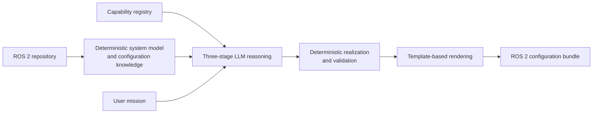
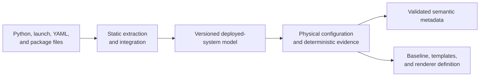
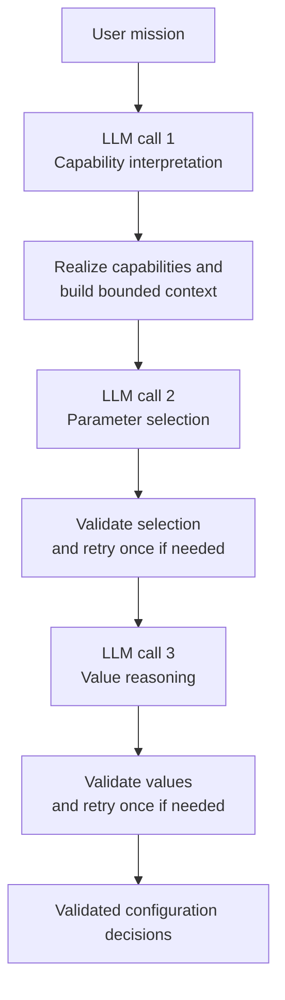
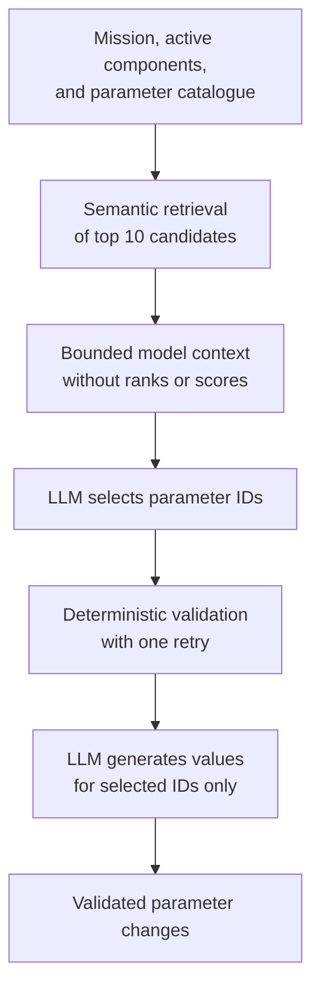
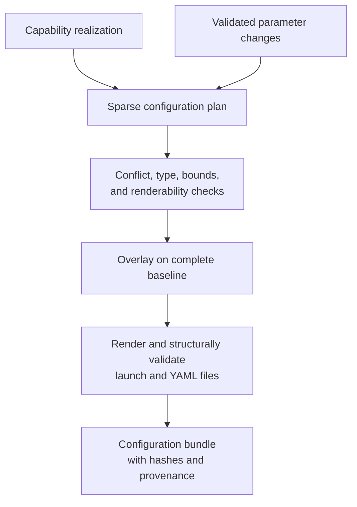
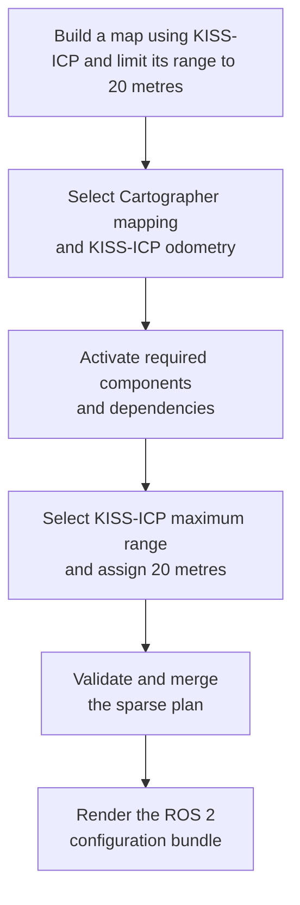

# Proposed Solution diagrams

These Mermaid diagrams accompany `proposed_solution.tex`. They are kept outside the LaTeX chapter so they can be reviewed and exported independently.

## 1. Complete proposed architecture

## 2. Deterministic knowledge and artifact generation

## 3. Three-call language-model pipeline

Suggested placement: immediately after the opening explanation in the `Natural-Language Configuration Reasoning` section.

## 4. Parameter retrieval and separated LLM reasoning

## 5. Sparse plan validation and configuration application

## 6. Representative end-to-end request

